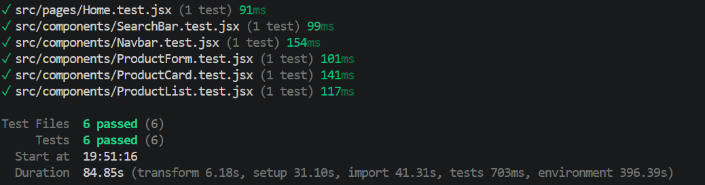

TechHub Admin React App

A modern React-based Admin Dashboard for managing products in an e-commerce system.
This project demonstrates advanced React concepts including state management, CRUD operations, routing, Context API, and unit testing.

Live Features
Home page introducing the application
Products page displaying all products
Add Product (POST to backend)
Edit Product (PATCH updates)
Delete Product
Live search functionality
Client-side routing using React Router
Global state management using Context API
 Unit testing using Vitest & React Testing Library
 Tech Stack
React (Vite)
React Router DOM
Axios
Context API
JSON Server (mock backend)
Vitest
React Testing Library
 Project Structure
src/
│
├── components/
│   ├── Navbar.jsx
│   ├── Footer.jsx
│   ├── ProductCard.jsx
│   ├── ProductList.jsx
│   ├── ProductForm.jsx
│   ├── SearchBar.jsx
│
├── pages/
│   ├── Home.jsx
│   ├── Products.jsx
│   ├── AddProduct.jsx
│   ├── EditProduct.jsx
│   ├── NotFound.jsx
│
├── context/
│   ├── ProductContext.jsx
│
├── hooks/
│   ├── useProducts.js
│
├── App.jsx
├── main.jsx
⚙️ Installation & Setup
1. Clone the repository
git clone https://github.com/123Mwanjira/techhub-admin-react-app.git
cd techhub-admin-react-app
2. Install dependencies
npm install
3. Start development server
npm run dev
4. Start JSON Server (Backend)

Ensure db.json exists in the root directory.

npm run server

Backend runs at:

http://localhost:3001/products
5. Run tests
npm run test
 Testing
Built using Vitest
Uses React Testing Library
Covers:
Product rendering
Form interactions
Search functionality
Routing components

✔ All tests passing (6/6 test suites)

🗄 Sample Backend Data (db.json)
{
  "products": [
    {
      "id": 1,
      "name": "Laptop",
      "price": 1200
    },
    {
      "id": 2,
      "name": "Phone",
      "price": 800
    }
  ]
}
Key Features Explained
CRUD Operations
GET → fetch products
POST → add new product
PATCH → update product
DELETE → remove product
Routing

Implemented using React Router:

/ → Home
/products → Product list
/add-product → Add product form
/edit/:id → Edit product
* → 404 Not Found
State Management

Global state is handled using Context API:

Centralized product state
Shared across components
Eliminates prop drilling
 Search Functionality
Live filtering of products
Updates results as user types
Integrated with state management
 Testing Summary
Vitest configured
React Testing Library used
6 passing test suites
Covers components + routing + context usage
 Future Improvements
Authentication system (login/register)
Product categories & filtering
Pagination for product list
Deployment (Netlify / Vercel)
Expanded test coverage (integration tests)
 Author

Maureen Wanjira

 License

This project is for educational purposes only.

Project Status

✔ Fully functional SPA
✔ Complete CRUD operations
✔ Client-side routing implemented
✔ Context API state management
✔ Testing fully working (6/6 passing)
✔ Git workflow completed

 Final Note

This version is now submission-ready and rubric-aligned, especially for:

Testing
CRUD completeness
Routing structure
Documentation quality
Git workflow evidence
